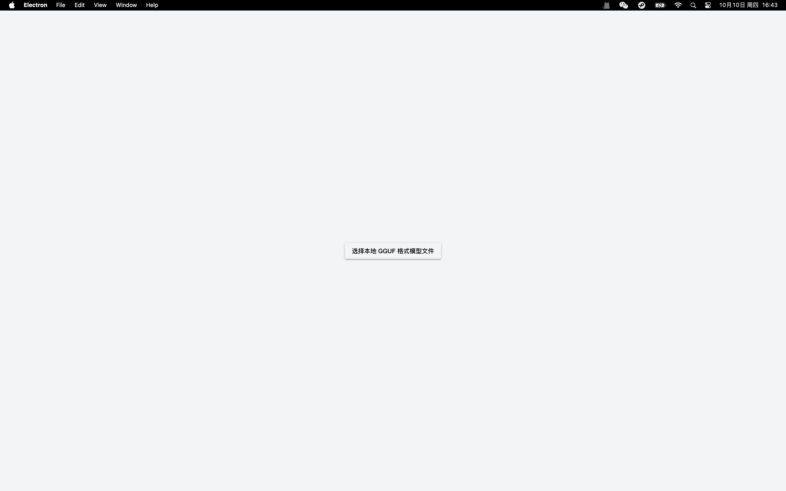
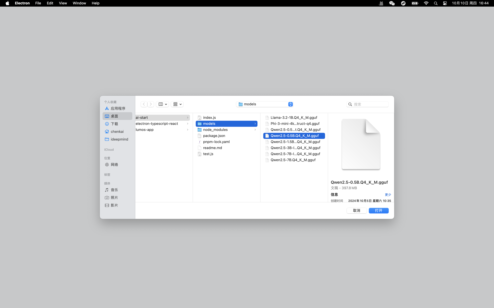
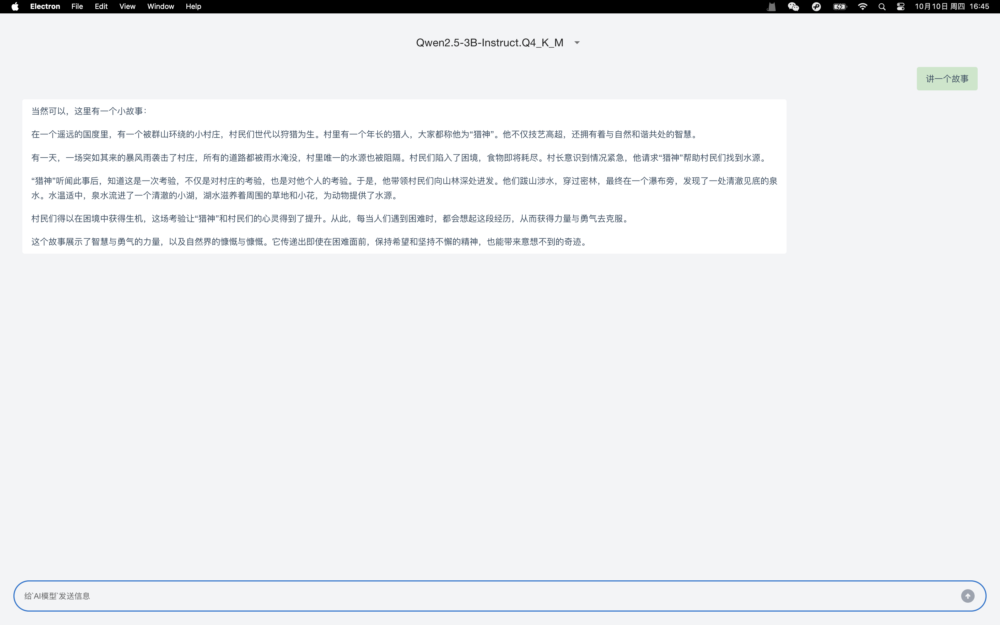
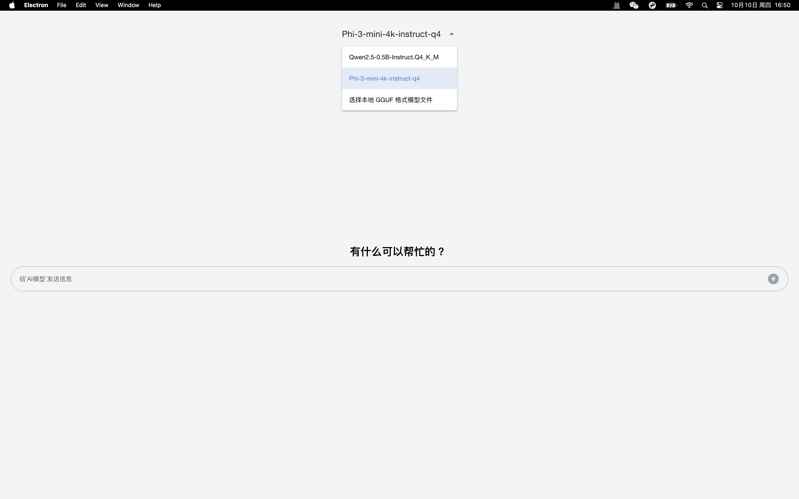

# lumos

在您的机器上本地运行 AI 模型

## 功能

+ 在计算机上本地运行 AI 模型
- 无需配置任何内容, MacOS 或者 Windosw 下载安装包直接使用
- 你可以自由的切换 GGUF 模型文件

## 使用

### 1.下载你对应机器的安装包
<https://github.com/ckvv/lumos/releases> 页面下载你对应机器的安装包

> 如果你未找到自己机器的安装包, 也可以选择源码构建构建
```shell
pnpm install
pnpm run build
```

### 2.获取 GGUF 模型

由于 GGUF 文件较大, 所以未内置到程序安装包,你可以在 Hugging Face 获取 GGUF 模型 <https://huggingface.co/models?library=gguf>

### 其他
# 产品截图





